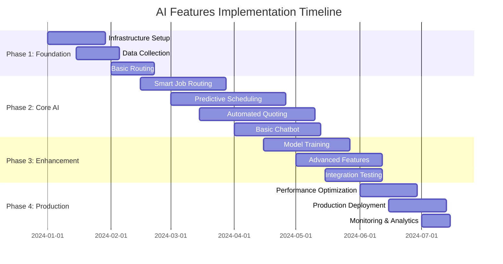

# Handyman Pro Documentation Index

This directory contains comprehensive documentation for the Handyman Pro application.

## Core Documentation

- **[README.md](./README.md)** - Main application overview, setup instructions, and feature descriptions
- **[FIRESTORE_STRUCTURE.md](./FIRESTORE_STRUCTURE.md)** - Complete database schema and structure documentation

## AI Features Documentation

### 🤖 AI-Powered Features (Roadmap)

The following documents outline the planned AI-driven enhancements for the Handyman Pro application:

- **[AI_FEATURES_SPECIFICATION.md](./AI_FEATURES_SPECIFICATION.md)** - Comprehensive technical specification for all AI features
  - Smart Job Routing requirements and architecture
  - Predictive Scheduling algorithms and data sources
  - Automated Quoting with image analysis
  - Chatbot Support with NLP integration
  - Database schema extensions
  - Success metrics and risk assessment

- **[AI_IMPLEMENTATION_GUIDE.md](./AI_IMPLEMENTATION_GUIDE.md)** - Practical developer implementation guide
  - Step-by-step implementation instructions
  - Code examples and integration patterns
  - Testing strategies and debugging tools
  - Deployment checklist and monitoring setup

### AI Features Overview

| Feature | Status | Priority | Complexity |
|---------|--------|----------|------------|
| **Smart Job Routing** | 📋 Planned | High | Medium |
| **Predictive Scheduling** | 📋 Planned | Medium | High |
| **Automated Quoting** | 📋 Planned | High | High |
| **Chatbot Support** | 📋 Planned | Medium | Medium |

### Implementation Timeline

### Key Benefits

- **🎯 Smart Job Routing**: 85% optimal assignment accuracy, 15-20% better worker utilization
- **⏰ Predictive Scheduling**: 80% time estimate accuracy, 30% fewer conflicts
- **💰 Automated Quoting**: 85% quote accuracy, 90% faster processing
- **🤖 Chatbot Support**: 70% resolution rate, 40% reduction in support costs

## Related Issues

- [Issue #7: AI-Powered Features Implementation](https://github.com/Yeeeetmaster69/Yeeeetmaster69.github.io/issues/7)

## Getting Started with AI Features

1. **Review the Specification**: Start with `AI_FEATURES_SPECIFICATION.md` to understand requirements
2. **Follow Implementation Guide**: Use `AI_IMPLEMENTATION_GUIDE.md` for step-by-step development
3. **Set Up Prerequisites**: Ensure Google Cloud APIs and OpenAI access
4. **Begin with Phase 1**: Start with Smart Job Routing as the foundation

## Contributing

When contributing to AI features:

1. Follow the implementation phases outlined in the specification
2. Maintain comprehensive testing as described in the implementation guide
3. Document any deviations from the planned architecture
4. Update success metrics based on real-world performance

## Support

For questions about AI features implementation:

- Review the troubleshooting section in `AI_IMPLEMENTATION_GUIDE.md`
- Check existing issues and discussions
- Ensure all prerequisites are properly configured
- Test with the provided code examples

---

*This documentation is part of the Handyman Pro application. Last updated: January 2024*